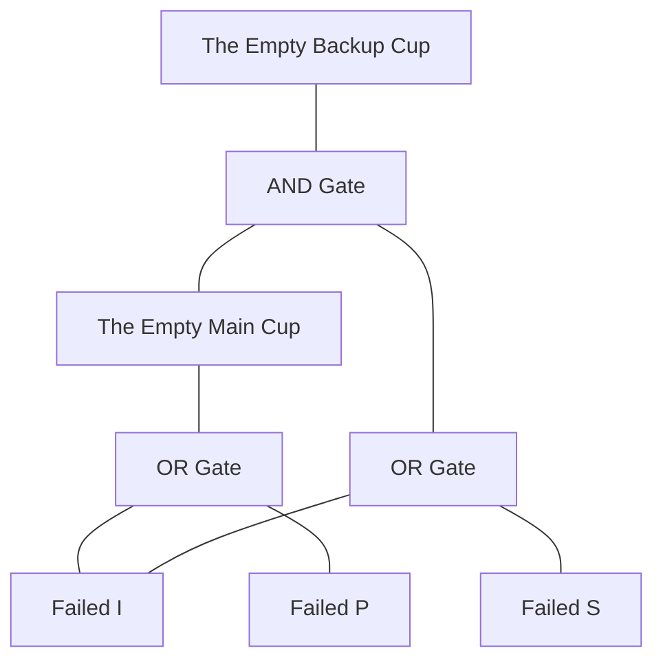

# Fault Tree Analysis: The Juice Shop Story 🥤

Imagine you have a **Juice Shop** that uses two machines to make sure customers always get their juice.

### The Team:
1. **The Fruit (I)**: This is the box of apples we need to make juice.
2. **The Big Juicer (P)**: This is our main machine. If it has fruit and isn't broken, it makes juice for the "Main Cup."
3. **The Helper Juicer (S)**: This machine is a bit shy. It only wakes up if it sees that the Big Juicer isn't pouring any juice.
4. **The Monitor**: This is like a little sensor that tells the Helper Juicer: "Hey! The Big Juicer stopped! Your turn to fill the Backup Cup!"

---

## 1. The Fault Trees ("The Why-Did-It-Stop Map")

A Fault Tree is like a map that shows all the ways something can break. We use **OR** gates (if *this* OR *that* happens, it breaks) and **AND** gates (it only breaks if *both* happen).

### Map for 'The Empty Main Cup' (Omission-normal)
The Big Juicer stops if:
*   **The Fruit is gone (Failed I)**
    *   **OR**
*   **The Big Juicer itself breaks (Failed P)**

### Map for 'The Empty Backup Cup' (Omission-standby)
The Helper Juicer stops only if two things happen at the same time:
1.  **The Big Juicer stopped** (so the Helper tried to wake up).
    *   **AND**
2.  **Something is wrong with the Helper's side**:
    *   **The Fruit is gone (Failed I)**
    *   **OR**
    *   **The Helper Juicer itself breaks (Failed S)**

### Visual Map (Interconnected)

---

## 2. The "What Happens If..." Table

Here is what happens to our two cups of juice when different parts break. 
*   **"Empty"** means no juice comes out (Omission).
*   **"Full"** means we get juice! ✅

| What Broke? | Main Cup (P) | Backup Cup (S) | Why? |
| :--- | :--- | :--- | :--- |
| **Nothing** | Full ✅ | Full ❌* | Everything is fine! (*Backup stays off because P is working). |
| **The Fruit (I)** | **Empty** 🛑 | **Empty** 🛑 | No apples = No juice for anyone. |
| **Big Juicer (P)** | **Empty** 🛑 | Full ✅ | The Helper Juicer sees P stopped and takes over! |
| **Helper Juicer (S)** | Full ✅ | Full ❌* | P is doing all the work, so S being broken doesn't matter yet. |
| **P and S both break**| **Empty** 🛑 | **Empty** 🛑 | P stopped, but S is broken too, so it can't help. |

---

### Simple Logic Summary for Grown-ups:
*   **The Empty Main Cup** = `Failed(I) OR Failed(P)`
*   **The Empty Backup Cup** = `The Empty Main Cup AND (Failed(I) OR Failed(S))`
*   This shows that the system is "Redundant" because even if the main machine (P) fails, the standby machine (S) can keep the juice flowing as long as we still have fruit!
