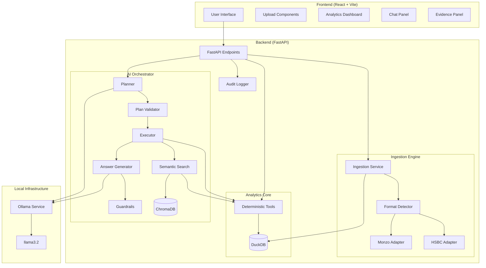

# Architecture Overview

LedgerMind Local is built as a multi-tier local application designed for high performance and absolute data privacy.

## System Architecture

## Component Breakdown

### 1. Ingestion Engine
The ingestion layer is designed with a pluggable adapter architecture.
-   **Format Detector:** Scans CSV headers to identify the source bank.
-   **Adapters:** Transform heterogeneous bank formats (Monzo's rich JSON-like CSV vs. HSBC's minimal history) into a unified internal schema.
-   **Validation:** Ensures transaction fingerprints prevent duplicate imports.

### 2. Analytics Core (Deterministic Tools)
To ensure 100% numerical accuracy, calculations are never performed by the LLM. Instead, a suite of Python/SQL tools execute queries against DuckDB:
-   `spending_summary`: Aggregates inflow, outflow, and net totals. Supports multi-entity filters (list of merchants/categories).
-   `top_merchants`: Identifies highest spending targets.
-   `recurring_payments`: Uses heuristic cadence analysis (weekly, monthly, quarterly) to find subscriptions.
-   `transaction_search`: High-performance filtering and full-text search.

### 3. Semantic Search Layer
Introduced in Milestone 7 to handle broad or conceptual queries.
-   **Vector Store (ChromaDB):** Stores embeddings of merchant names, categories, and transaction descriptions.
-   **Embedding Client:** Uses local Ollama embeddings (`llama3.2`) to vectorize text.
-   **Hybrid Matcher:** When a user asks a broad question (e.g., "Show my coffee spending"), the system uses vector search to find relevant candidate merchants (Starbucks, Costa) and categories (Coffee).
-   **Execution:** The candidate list is then passed to the deterministic `spending_summary` tool for final calculation. This ensures semantic flexibility without sacrificing numerical accuracy.

### 4. AI Orchestrator (Planner-Executor)
This is the "brain" of the application.
-   **Planner:** Interprets the user's natural language and selects the appropriate tool and arguments.
-   **Executor:** Runs the tool and captures "evidence" (raw data, query parameters, row counts).
-   **Answer Generator:** Takes the tool results and user query to produce a natural language summary.
-   **Guardrails:** Intercepts out-of-scope requests (e.g., financial advice) at both the input and output stages.

### 5. Data Layer
-   **DuckDB:** An embedded OLAP database file (`ledgermind.db`). It provides the speed of an in-memory database with the persistence of a local file, making it ideal for analytical financial queries.
-   **ChromaDB:** A local vector database for semantic indexing.
-   **Audit Logs:** All major system events (DB init, imports, query failures) are logged to a separate audit table for transparency.

## Data Flow: Chat Query
1.  **User Input:** "How much did I spend at Tesco last month?"
2.  **Input Guardrail:** Checks for malicious intent or off-topic prompts.
3.  **Planner:** Calls Ollama (`llama3.2`) to generate a JSON plan: `{"tool": "spending_summary", "arguments": {"merchant": "Tesco", "date_from": "2026-01-01", "date_to": "2026-01-31"}}`.
4.  **Plan Validator:** Ensures the requested tool exists and arguments are safe.
5.  **Executor:** Calls `get_spending_summary` with the generated arguments.
6.  **Deterministic Tool:** Executes SQL against DuckDB and returns a structured result + evidence metadata.
7.  **Answer Generator:** Calls Ollama to summarize the SQL result into "You spent £42.50 at Tesco in January 2026 across 3 transactions."
8.  **Output Guardrail:** Ensures the answer doesn't contain hallucinations or prohibited advice.
9.  **UI Render:** Displays the answer and populates the **Evidence Panel** with the plan and tool results.
